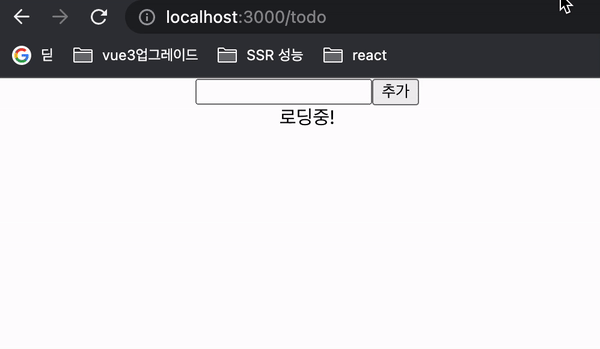

> ## 추가 설치 한 의존성 (기본 CRA 이외)

1. react-router-dom (react 에서 라우팅을 위한 패키지)
2. typescript (개발 효율 향상 및 런타임 에러 컴파일 타임에서 방지)
3. eslint (개발 경험 향상, 코드 작성 규칙 정해줌)
4. prettier (개발 경험 향상, tab space 과 같은 코드 스타일 획일화 해줌)

> ## 화면(url 기준)

1. /signup  
   회원가입 기능이 있으며...
2. /signin
3. /todo  
   특이사항 - 서버 응답에 setTimeout(1초) 를 줘 강제 suspense 동작  
   

> ## 사용 가능 API (Back End)

[API github 주소](https://github.com/walking-sunset/selection-task)  
c.f.) api는 https://pre-onboarding-selection-task.shop/ 로 domain을 잡아주자

1. /auth/signup - POST
2. /auth/signin - POST
3. /todos - GET, POST
4. /todos/:id - PUT, DELETE

> ## 과제 요구사항

1. 로그인/회원가입 기능
   1. [Assignment1](https://github.com/walking-sunset/selection-task#:~:text=%EB%8A%94%20%EB%8F%99%EC%9D%BC%ED%95%B4%EB%8F%84%20%EB%AC%B4%EB%B0%A9%ED%95%A9%EB%8B%88%EB%8B%A4.-,Assignment%201,-%ED%9A%8C%EC%9B%90%EA%B0%80%EC%9E%85%EA%B3%BC%20%EB%A1%9C%EA%B7%B8%EC%9D%B8%20%ED%8E%98%EC%9D%B4%EC%A7%80%EC%97%90)
      - [x] 회원가입과 로그인 페이지에 이메일과 비밀번호의 유효성 검사기능을 구현해주세요
      - [x] 입력된 이메일과 비밀번호가 유효성 검사를 통과하지 못한다면 button에 disabled 속성을 부여해주세요
   2. [Assignment2](https://github.com/walking-sunset/selection-task#:~:text=%ED%8C%A8%EC%8A%A4%EC%9B%8C%EB%93%9C%20%EC%82%AC%EC%9A%A9%EC%9D%84%20%EA%B6%8C%EC%9E%A5%EB%93%9C%EB%A6%BD%EB%8B%88%EB%8B%A4.-,Assignment%202,-%ED%9A%8C%EC%9B%90%EA%B0%80%EC%9E%85%20%ED%8E%98%EC%9D%B4%EC%A7%80%EC%97%90%EC%84%9C%20%EB%B2%84%ED%8A%BC%EC%9D%84)
      - [x] 회원가입 페이지에서 버튼을 클릭 시 회원가입을 진행하고 회원가입이 정상적으로 완료되었을 시 /signin 경로로 이동해주세요
   3. [Assignment3](https://github.com/walking-sunset/selection-task#:~:text=signin%20%EA%B2%BD%EB%A1%9C%EB%A1%9C%20%EC%9D%B4%EB%8F%99%ED%95%B4%EC%A3%BC%EC%84%B8%EC%9A%94-,Assignment%203,-%EB%A1%9C%EA%B7%B8%EC%9D%B8%20%ED%8E%98%EC%9D%B4%EC%A7%80%EC%97%90%EC%84%9C%20%EB%B2%84%ED%8A%BC%EC%9D%84)
      - [x] 로그인 페이지에서 버튼을 클릭 시, 로그인을 진행하고 로그인이 정상적으로 완료되었을 시 /todo 경로로 이동해주세요
   4. [Assignment4](https://github.com/walking-sunset/selection-task#:~:text=%EB%A1%9C%EC%BB%AC%20%EC%8A%A4%ED%86%A0%EB%A6%AC%EC%A7%80%EC%97%90%20%EC%A0%80%EC%9E%A5%ED%95%B4%EC%A3%BC%EC%84%B8%EC%9A%94-,Assignment%204,-%EB%A1%9C%EA%B7%B8%EC%9D%B8%20%EC%97%AC%EB%B6%80%EC%97%90%20%EB%94%B0%EB%A5%B8)
      - [x] 로그인 여부에 따른 리다이렉트 처리를 구현해주세요
2. Todo List 기능
   1. [Assignment5](https://github.com/walking-sunset/selection-task#:~:text=2.%20TODO%20LIST-,Assignment%205,-/todo%EA%B2%BD%EB%A1%9C%EC%97%90%20%EC%A0%91%EC%86%8D%ED%95%98%EB%A9%B4)
      - [x] /todo경로에 접속하면 투두 리스트의 목록을 볼 수 있도록 해주세요
      - [x] 목록에서는 TODO의 내용과 완료 여부가 표시되어야 합니다.
      - [x] TODO의 완료 여부는 \<input type="checkbox" />를 통해 표현해주세요
      - [x] TODO는 \<li> tag를 이용해 감싸주세요
   2. [Assignment 6](https://github.com/walking-sunset/selection-task#:~:text=%3C/li%3E-,Assignment%206,-%EB%A6%AC%EC%8A%A4%ED%8A%B8%20%ED%8E%98%EC%9D%B4%EC%A7%80%EC%97%90%20%EC%83%88%EB%A1%9C%EC%9A%B4)
      - [x] 리스트 페이지에 새로운 TODO를 입력할 수 있는 input과 추가 button을 만들어주세요
      - [x] 추가 button을 클릭하면 입력 input의 내용이 새로운 TODO로 추가되도록 해주세요
   3. [Assignment 7](https://github.com/walking-sunset/selection-task#:~:text=%EB%A1%9C%20%EC%B6%94%EA%B0%80%EB%90%98%EB%8F%84%EB%A1%9D%20%ED%95%B4%EC%A3%BC%EC%84%B8%EC%9A%94-,Assignment%207,-TODO%EC%9D%98%20%EC%B2%B4%ED%81%AC%EB%B0%95%EC%8A%A4%EB%A5%BC)
      - [x] TODO의 체크박스를 통해 완료 여부를 수정할 수 있도록 해주세요.
   4. [Assignment 8](https://github.com/walking-sunset/selection-task#:~:text=%EC%88%98%20%EC%9E%88%EB%8F%84%EB%A1%9D%20%ED%95%B4%EC%A3%BC%EC%84%B8%EC%9A%94.-,Assignment%208,-TODO%20%EC%9A%B0%EC%B8%A1%EC%97%90%20%EC%88%98%EC%A0%95%EB%B2%84%ED%8A%BC%EA%B3%BC)
      - [x] TODO 우측에 수정버튼과 삭제 버튼을 만들어주세요
   5. [Assignment 9](https://github.com/walking-sunset/selection-task#:~:text=%3C/li%3E-,Assignment%209,-%ED%88%AC%EB%91%90%20%EB%A6%AC%EC%8A%A4%ED%8A%B8%EC%9D%98%20%EC%82%AD%EC%A0%9C)
      - [x] 투두 리스트의 삭제 기능을 구현해주세요
   6. [Assignment 10](https://github.com/walking-sunset/selection-task#:~:text=%EC%95%84%EC%9D%B4%ED%85%9C%EC%9D%B4%20%EC%82%AD%EC%A0%9C%EB%90%98%EB%8F%84%EB%A1%9D%20%ED%95%B4%EC%A3%BC%EC%84%B8%EC%9A%94-,Assignment%2010,-%ED%88%AC%EB%91%90%20%EB%A6%AC%EC%8A%A4%ED%8A%B8%EC%9D%98%20%EC%88%98%EC%A0%95)
      - [x] 투두 리스트의 수정 기능을 구현해주세요

> c.f.)

1. fallback(error 처리)
2. 수정, 삭제 시 확인 요청을 위해 alert 나 modal popup
3. todo list 업데이트 시 모든 todoitem 컴포넌트가 리렌더링 되는 것 같은데, useMemo 로 이를 방지 가능한지?
4. 상용 환경에서 log 안찍히도록??
5. navbar 만들어서 라우팅 쉽게 하기
6. 로그아웃 버튼 만들어서 로그아웃 편하게 하기.

> ## 참고한 자료들

> > [navigation guard](https://blog.netcetera.com/how-to-create-guarded-routes-for-your-react-app-d2fe7c7b6122)
